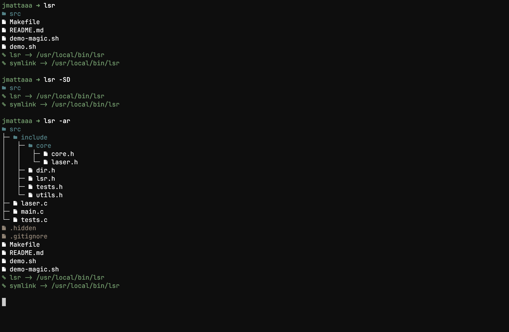

<div align="center">

# Laser

###### (lsr) Basically `ls` but readable 



</div>

**lsr** basically `ls` but with colorization and sorting for better readability.
It offers filtering options, making it easy to
locate specific files and folders (with grep you'll find exactly what you need)
It can even display the directory contents in a tree-like structure! :fire:

## Installation

### Building from source

Clone the repository:

```sh
git clone https://github.com/jmattaa/laser.git
cd laser
```

Install system-wide:

```sh
sudo make install
```

To uninstall you can run

```sh
sudo make uninstall
```

## Usage

After installing you can run laser in your current directory by simply
running:
```sh
lsr
# or for a specific directory run:
lsr some-directory
```

### Change colors or add icons

If you want to change the colors of the output you can set an environment 
variable called `LSR_COLORS` for example if you want to add nerd font icons to
the existing colors you can use:

```sh
export LSR_COLORS="DIR=\x1b[34m :\
SYMLINK=\x1b[36m :\
FILE=\x1b[0m :\
HIDDEN=\x1b[90m :\
EXEC=\x1b[32;4m :\
ARCHIVE=\x1b[31m :\
MEDIA=\x1b[33m :\
DOCUMENT=\x1b[35;3m :"
```

You don't have to change all of these if there is only one you want to change
you can do that, to leave the rest on default

### Command-line options

The command-line options can be added by passing flags. These flags can be put 
before or after the directory you want to search, if there is no directory
you can directly pass in the flags.

- `-a` or `--all` shows hidden files
- `-D` or `--Directories` shows only directories
- `-F` or `--Files` shows only files
- `-S` or `--Symlinks` shows only symlinks
- `-G` or `--Git` shows only the entries that are not named in `.gitignore` (works only if there exists a `.gitignore`)
- `-r` or `--recursive` shows directory tree structure
    - `-r` or `--recursive` has an optional value for max depth and  it can be 
    used by using `-r2` or `--recursive=2` by default the depth is until last 
    level


The flags can be chained for example using:
```sh
lsr -Dar # this will show all directories including hidden ones recursivly
lsr -GDS # this will only show directories (not hidden) and symlinks that are not mentioned in .gitignore
```

# Contributing

Feel free to contribute to this project to make it better :rocket: check the 
[CONTRIBUTING.md](/CONTRIBUTING.md) and follow the guidlines from there!

# Authors
- [@jmattaa](https://github.com/jmattaa)
